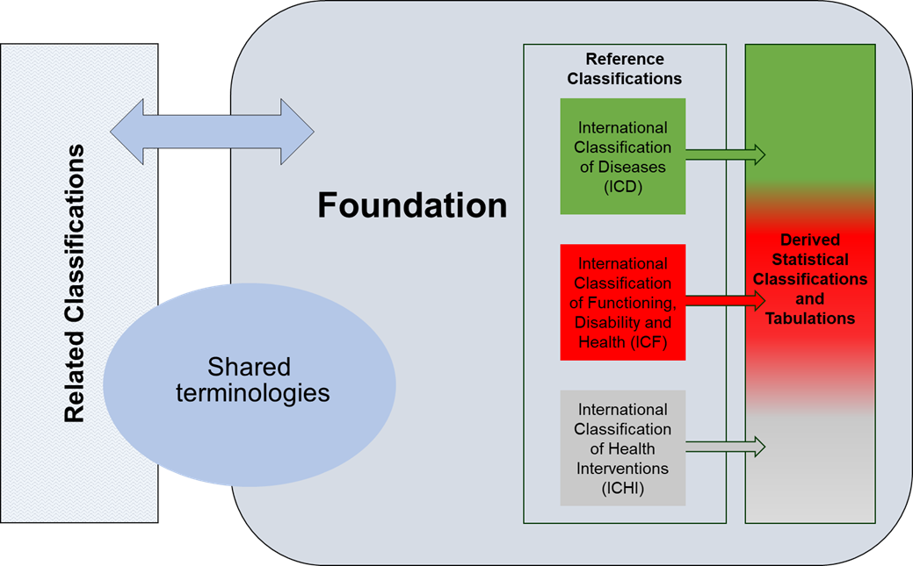

###	ICD in the context of WHO Family of International Classifications (WHO-FIC)

The WHO Family of International Classifications (WHO-FIC) comprises classifications that have 
been endorsed by the WHO to describe various aspects of health and the health system in a 
consistent manner.

The WHO-FIC provides standardised building blocks for health information systems and consists 
of three broad groups: Reference classifications, Derived classifications, and Related 
classifications. 

The Reference and the Derived classifications are based on the Foundation Component, which 
is a large collection of terms and their relationships, which describe health and health related domains. 

Terms related to diseases and health related problems are organised into the ICD, 
those pertaining to functioning into the ICF, and those related to interventions into ICHI 
(International Classification of Health Interventions). Terms from the Foundation Component 
may be used in more than one Reference classification. 

Derived Statistical Classifications and Tabulations (‘derived classifications’) draw on terms that 
may come from one or more of the Reference classifications. 
Within the WHO-FIC Family, Related classifications are regarded as complementary to the 
Reference and Derived classifications. Related classifications have their own sets of terms, but 
can also share terms as part of the WHO-FIC Family. For example, the International 
Classification of Nursing Practice (ICNP), a related classification in the Family, draws on terms 
from the Foundation Component in the same way that the reference and derived classifications 
draw on terms from the Foundation Component. ICNP also uses terms specific to nursing 
practice which are not found in the Foundation Component, but which may be included in the 
future. 
 
<!--FIGURE WHOFIC Family to be replaced by final figure -->

**Figure 1:** *Relationships between the WHO Family of International Classifications and related classification, the 
Foundation Component, and shared terminologies.* 

The purpose of the WHO-FIC is to assist the development of reliable statistical systems at 
local, national, and international levels, with the aim of improving health status and health 
care. The classifications are the property of the WHO or other groups. Health related 
information might sometimes require additional detail to that contained in the ICD. A group or 
‘family’ of health relevant classifications covers these needs both by classification of domains 
different from those of the ICD and provision of more detail for specific uses, e.g. cancer 
registration. The WHO-FIC designates a suite of integrated classification products that share 
similar features and can be used singularly or jointly to provide information on different aspects 
of health and health care systems. For example, the ICD as a reference classification is mainly 
used to capture mortality and morbidity. Functioning is classified in the International 
Classification of Functioning, Disability and Health (ICF) and health interventions in the 
International Classification of Health Interventions (ICHI).

In general, the WHO-FIC aims to provide a conceptual framework of information dimensions 
which are related to health and health management. In this way, it provides a common 
language that improves communication and permits comparisons of data within countries, 
across countries, health care disciplines, services, and time. The WHO and the WHO-FIC 
Network (including Collaborating Centres, Non-Governmental Organisations, and selected 
experts) strive to build the family of classifications based on sound scientific and taxonomic 
principles, ensure that it is culturally appropriate and internationally applicable, and meet the 
needs of its different users by focusing on the multi-dimensional aspects of health.
